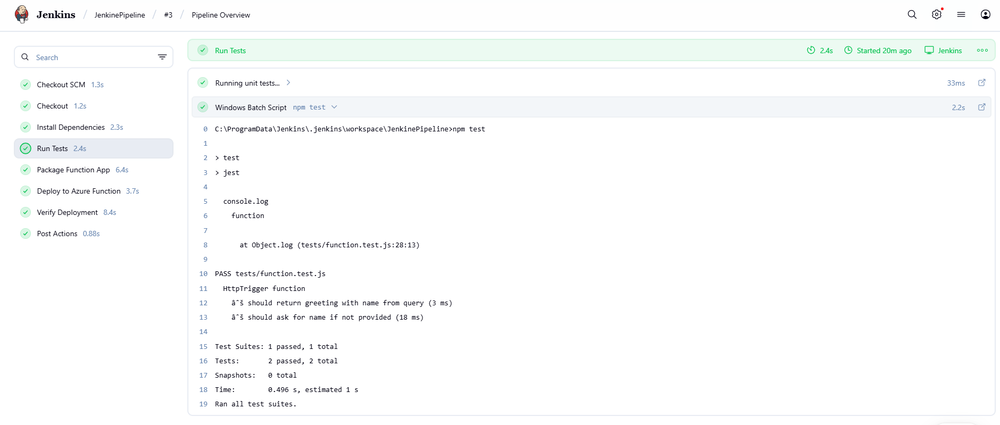
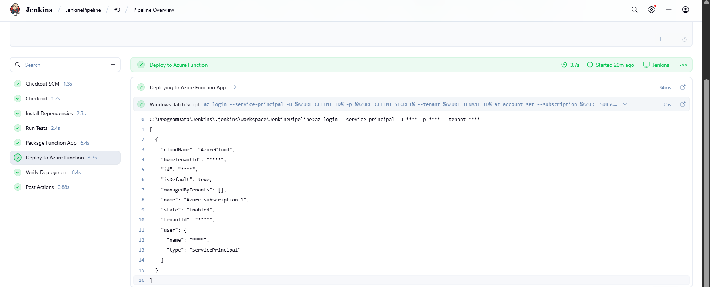
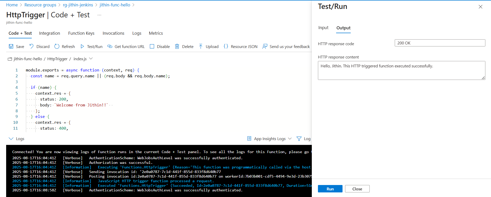
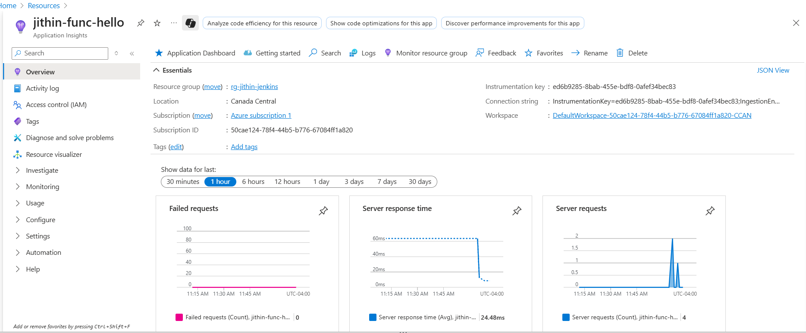
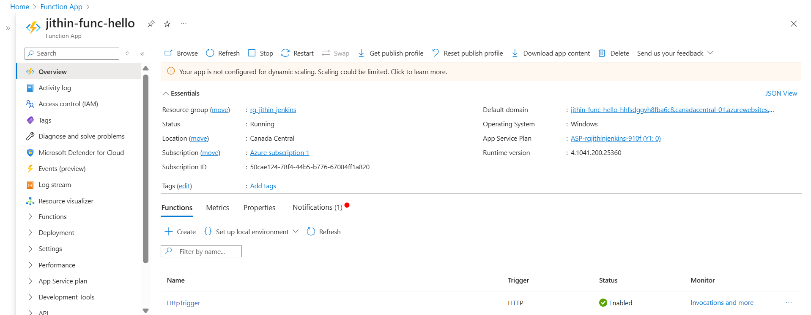
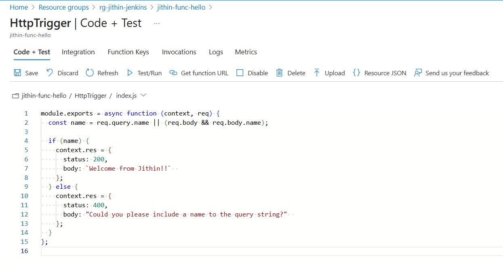
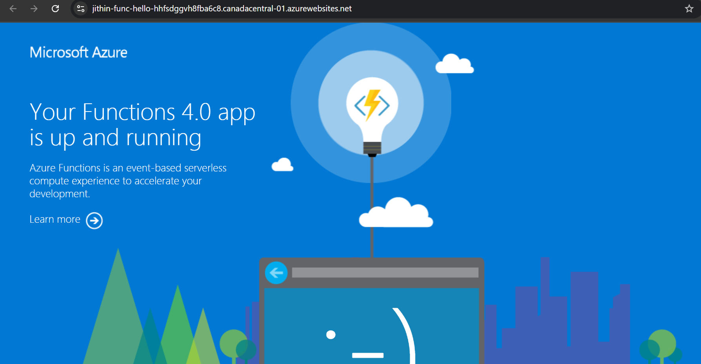
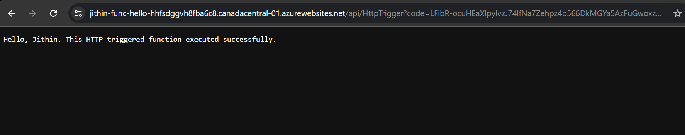
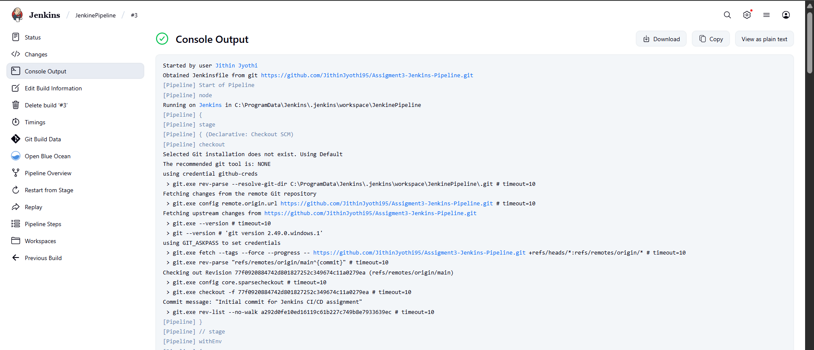
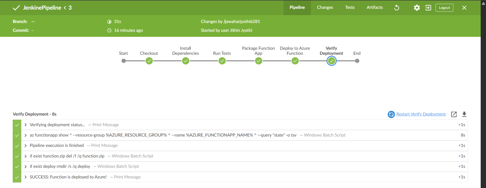

# Assignment 3 - Jenkins CI/CD Pipeline with Azure Function App

This demonstrates a complete CI/CD pipeline using Jenkins to build, test, and deploy an Azure Function written in JavaScript (Node.js). The goal is to automate the workflow using Jenkins stages including test validation, packaging, and Azure deployment.

## Tech Stack
- Azure Functions (Node.js)
- Jenkins Pipeline
- Jest for Testing
- GitHub Repository Integration
- Azure Portal (Function App + Resource Group)
- Windows Batch Shell for Jenkins

# Create a service principal with RBAC for Jenkins integration
powershell
```
az ad sp create-for-rbac \
  --name "jenkins-jithin-sp" \
  --role contributor \
  --scopes /subscriptions/<SUBSCRIPTION_ID>/resourceGroups/rg-jithin-jenkins \
  --sdk-auth
  ```

## Jenkins Pipeline Overview Overview

1. **Checkout SCM**: Clones the GitHub repo containing the Azure Function.
2. **Install Dependencies**: Runs `npm install` to prepare the environment.
3. **Run Tests**: Executes Jest unit tests.
   
4. **Package Function App**: Prepares the Azure Function App for deployment.
5. **Deploy to Azure Function**: Uploads the package to Azure.
   
6. **Verify Deployment**: Confirms the function is deployed and responsive.
   
7. **Post Actions**: Wraps up the pipeline.

## Azure Portal Validation

### Resource Group
The function app and supporting resources appear under the expected resource group:


### Azure Function Overview
The deployed function is listed and active in the Azure portal:


### Code Verification
You can inspect the deployed code inside Azure:


## Runtime Verification

### Function Running Log
Confirmation that the function is active:


### Browser Output
When accessed in a browser, the function responds correctly:


## Jenkins Pipeline Proof

### Console Output
Shows logs for all executed stages:


### Pipeline Success UI
Visually confirms all steps passed:


## Summary

This pipeline ensures the Azure Function is tested, built, and deployed automatically with each Git commit or manual trigger. All steps are verifiable via Jenkins and Azure.

---
**Note:** Make sure your Jenkins server is configured with necessary Azure credentials and that the Azure CLI is installed on the agent.


---